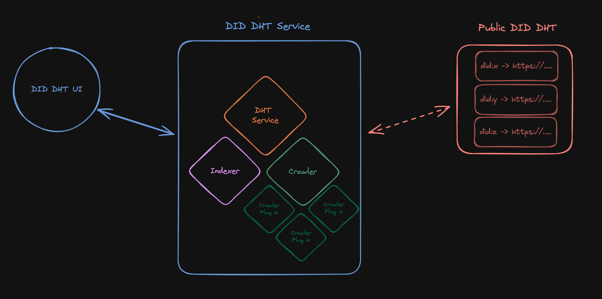

# DID DHT

A DID-based network relying upon the IPFS DHT which facilitates the discovery of DID Documents and associated endpoints.

## Design

The service has three components: the DHT, crawler, and indexer.

### DHT

The DHT is a distributed hash table which stores the DID Documents and associated endpoints.

To enter into the DHT, the service must receive a message signed by a DID Document containing the endpoint(s) it wishes
to advertise. If the message is not signed, the service will sign the message with its own DID and publish it to the
network. Future enhancements will enable strategies to only accept self-signed messages, prevent spam, and be able to 
determine which record(s) should be overwritten in the event of a collision.

In addition to writing the record to the DHT, the service will gossip the record over gossipsub to its
peers. In this manner a node may become aware of a new entry in the DHT without having to query the DHT directly.

The DHT handles queries for DID Documents and endpoints and re-publishes them to the network on a regular interval.

### Crawler

The crawler is a service which crawls the endpoints made available via the DHT. It will attempt to uncover new data
and make the data available for indexing via the indexer.

It is anticipated that there are custom crawlers and indexers for different types of data. For example, a crawler
can be specifically written for the ION network, which understands how to traverse the network and re-assemble the current
state of any DID Document on it, and leverage it's [type registry](https://github.com/decentralized-identity/sidetree/blob/master/docs/type-registry.md)
to discover new data.

### Indexer

The indexer is responsible for indexing all content made available by the crawler. It will store the data in a
database and make it available for query via a REST API.

The indexer will be used to back a UI which allows users to search for DID Documents, their endpoints, and associated
semantic data.

## Project Resources

| Resource                                                                               | Description                                                                   |
|----------------------------------------------------------------------------------------|-------------------------------------------------------------------------------|
| [CODEOWNERS](https://github.com/TBD54566975/did-dht/blob/main/CODEOWNERS)              | Outlines the project lead(s)                                                  |
| [CODE_OF_CONDUCT](https://github.com/TBD54566975/did-dht/blob/main/CODE_OF_CONDUCT.md) | Expected behavior for project contributors, promoting a welcoming environment |
| [CONTRIBUTING](https://github.com/TBD54566975/did-dht/blob/main/CONTRIBUTING.md)       | Developer guide to build, test, run, access CI, chat, discuss, file issues    |
| [GOVERNANCE](https://github.com/TBD54566975/did-dht/blob/main/GOVERNANCE.md)           | Project governance                                                            |
| [SECURITY](https://github.com/TBD54566975/did-dht/blob/main/SECURITY.md)               | Vulnerability and bug reporting                                               |
| [LICENSE](https://github.com/TBD54566975/did-dht/blob/main/LICENSE)                    | Apache License, Version 2.0                                                   |
